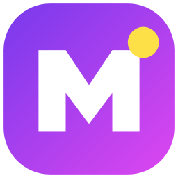
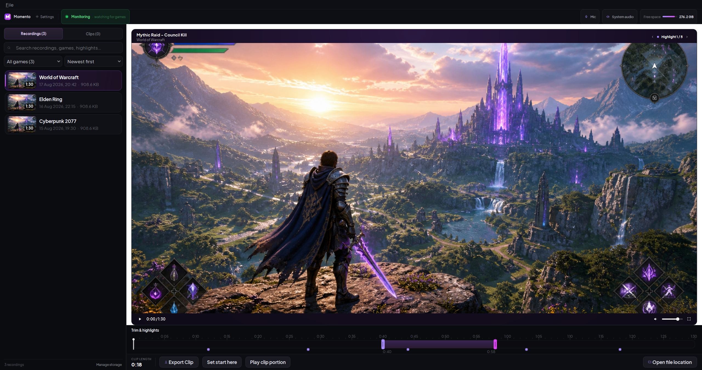
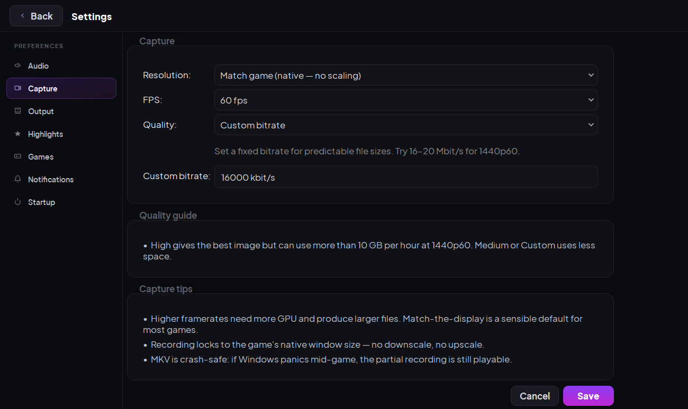

<p align="center">
  
</p>

<h1 align="center">Momento</h1>

<p align="center">
  Automatic game recording for Windows, with local playback, bookmarks, and fast clip export.
</p>

<p align="center">
  <a href="https://github.com/Vanexia/momento/releases/latest"><strong>Download Momento</strong></a>
  &nbsp;|&nbsp;
  <a href="https://vanexia.github.io/momento/privacy.html">Privacy</a>
  &nbsp;|&nbsp;
  <a href="https://github.com/Vanexia/momento/issues">Report an issue</a>
</p>

<p align="center">
  <a href="https://github.com/Vanexia/momento/releases/latest"></a>
  <a href="https://github.com/Vanexia/momento/actions/workflows/ci.yml"></a>
  
  <a href="LICENSE"></a>
</p>

## Download

Download **[MomentoSetup-0.2.7.exe](https://github.com/Vanexia/momento/releases/download/v0.2.7/MomentoSetup-0.2.7.exe)** from the latest release.

The installer includes everything Momento needs. Python and administrator access are not required.

> [!IMPORTANT]
> Momento's installer is not code-signed yet. Windows may show **Unknown Publisher** or a SmartScreen warning. Confirm that the download came from this repository, select **More info**, then **Run anyway**. The release includes a SHA-256 checksum for integrity checking.

Download `SHA256SUMS-0.2.7.txt` from the same release and compare the listed
installer hash before running it:

```powershell
Get-FileHash .\MomentoSetup-0.2.7.exe -Algorithm SHA256
Get-Content .\SHA256SUMS-0.2.7.txt
```

The two SHA-256 values must match. A checksum detects a damaged or replaced
download; it does not give the unsigned installer a publisher identity.



<p align="center"><sub>The real Momento interface, shown with sample media.</sub></p>

## What Momento Does

- **Records automatically.** Momento watches a configurable game list and starts when a matching game window appears.
- **Captures the game, microphone, and system audio.** Windows Graphics Capture records the game window rather than the whole desktop.
- **Marks moments while you play.** Press the configurable bookmark hotkey, `F8` by default, to add timeline markers.
- **Turns recordings into clips.** Browse, search, preview, repair, trim, and export MP4 clips without re-encoding.
- **Keeps your library local.** The standard public build has no Momento
  account, telemetry, analytics, or cloud library. Recordings and clips stay on
  your computer.

Recordings use MKV for better crash tolerance. Finished clips use MP4 for straightforward sharing.

## Getting Started

1. Install Momento and complete the first-run setup.
2. Confirm your microphone, playback device, output folder, and games list.
3. Leave Momento in the system tray and launch a configured game.
4. Use `F8` to bookmark moments while playing.
5. Close the game, open Momento from the tray, and export the section you want.



## YouTube Uploads

YouTube upload is optional. The public installer includes the upload controls
and Google client libraries, but it does not contain a Google OAuth project or
developer identity. Create a Desktop OAuth client in a Google Cloud project
you control, then import its JSON file in **Settings > YouTube**.

Momento validates the file and stores a DPAPI-encrypted copy at
`%APPDATA%\Momento\youtube_oauth_client.dat`. It never places the client file in
the installer, source archive, logs, or release assets. The connected account
token uses a separate DPAPI-encrypted file.

Read [Set up YouTube uploads](docs/youtube-setup.md) for the Google Cloud steps,
the two requested scopes, Testing-mode token expiry, upload visibility limits,
and removal instructions.

## Updates

The installed build checks the latest stable GitHub Release once when Momento
starts. It does not poll for updates while it runs. You can also choose **Check
for updates...** from the tray menu or **Help > Check for updates...** in the
editor.

A startup check downloads, verifies, and installs a newer stable release when
Momento is idle. A manual check downloads and verifies the update first, then
offers **Install now** and **Later**. **Later** keeps the verified installer for
the next time Momento starts.

GitHub receives the connection's IP address and the fixed User-Agent
`Momento-Updater/1`, as it does for an ordinary HTTPS request. Momento sends no
recording, account, game-list, or device data with the check.

Momento accepts an update only after it verifies Ed25519-signed release metadata
and the installer's exact size and SHA-256. If recording, finalization, repair,
trimming, uploading, or another editor task is active, Momento keeps the
verified download and installs it on the next launch instead of interrupting
your work.

Source runs do not contact the update service or install updates. The manual
command reports that self-update requires the installed build.

## Capture And Storage

Momento records at the game's native window size by default. Fresh installations use 60 fps and a fixed 16,000 kbit/s bitrate, which uses approximately **7.2 GB per hour**, plus audio and container overhead. Higher quality settings can exceed 10 GB per hour at 1440p60.

The encoder checks the requested resolution, frame rate, and quality before recording. It tries compatible hardware encoders in this order:

1. NVIDIA NVENC
2. AMD AMF
3. Intel QuickSync
4. Media Foundation
5. libx264 CPU encoding

Momento warns when it falls back to CPU encoding because high resolutions and frame rates can use substantial processor time.

Public releases use a reproducible PyAV 17.0.1 wheel with a purpose-built
FFmpeg 8.0.1 runtime. It keeps H.264/AAC recording and the encoder paths above
while reducing PyAV's native DLL payload by 80.6%. NVIDIA has passed physical
recording tests; AMD and Intel remain automated contract tests pending wider
physical hardware coverage.

## Requirements

| | Requirement |
|---|---|
| Operating system | 64-bit Windows 10 version 1903 or newer, or Windows 11 |
| Disk space | About 615 MB installed, plus space for recordings |
| Graphics | Hardware H.264 encoding recommended; CPU fallback available |
| Audio | A Windows microphone and/or playback endpoint if those tracks are wanted |

NVIDIA NVENC has passed physical hardware testing. AMD AMF, Intel QuickSync, Media Foundation, and CPU fallback have automated coverage but still need wider field testing across real machines and drivers.

## Privacy

The standard public build stores settings, logs, thumbnails, recordings, and
clips on your computer. It includes optional, user-configured YouTube upload
controls but no Google OAuth identity. Installed builds contact GitHub Releases
once at startup to check for a signed update. GitHub receives the source IP and
`Momento-Updater/1` User-Agent; Momento sends no account or recording data.

- No Momento account
- No telemetry or analytics
- No advertising
- No automatic uploads
- No background cloud library

Read the full [privacy policy](https://vanexia.github.io/momento/privacy.html).

## Uninstalling

The uninstaller asks whether to remove Momento's settings, logs, and local
YouTube account state. The default choice preserves them. Silent uninstall also
preserves them unless it uses `/PURGEUSERDATA`. Neither choice deletes
recordings or exported clips.

Use `/PURGEUSERDATA` only when you want to remove Momento's AppData state,
including the imported Google OAuth client and connected-account token.

## Known Limitations

- The current installer is unsigned.
- System audio records the full mix sent to the selected playback device, not game audio in isolation.
- Clip boundaries are keyframe-accurate because exports avoid re-encoding.
- Momento does not provide a replay buffer, streaming, webcam capture, or HDR recording.
- Live recordings cannot be previewed or edited until finalization finishes.

## Troubleshooting

**A game was not recorded:** Check that monitoring is active and that the game's executable appears in Settings under Games. The log at `%APPDATA%\Momento\logs\momento.log` records detection, window retries, encoder selection, and finalization.

**Microphone or system audio is missing:** Open Settings and reselect both devices. Windows and driver updates can change endpoint identifiers even when the visible device name stays the same.

**The recording drops frames:** Check the recording log for the selected encoder and drop count. Common causes include a fully loaded GPU, another recording application using the encoder, or CPU fallback at an ambitious recording profile.

**The tray icon is not visible:** Check the Windows tray overflow area.

## Run From Source

Momento requires Python 3.12 for source runs. Automatic update checks and installation stay disabled in this mode.

```powershell
git clone https://github.com/Vanexia/momento.git C:\dev\Momento
cd C:\dev\Momento
py -3.12 -m venv .venv
.\.venv\Scripts\python.exe -m pip install -c constraints-release.txt -e .[dev]
.\scripts\fetch_ffmpeg.ps1
.\.venv\Scripts\python.exe -m momento --show
```

Hardware-independent checks run in [GitHub Actions](https://github.com/Vanexia/momento/actions). WGC, real audio devices, and hardware encoders require a Windows machine with suitable hardware.

## Build A Release

Create releases only from a clean committed tree with Momento closed:

```powershell
.\scripts\build_installer.ps1
```

The release builder verifies dependencies and bundled tools, scans for private
runtime data, builds the application and installer, exercises an isolated
install and upgrade cycle, and produces the installer checksum and corresponding
source archives. Packaged builds omit unused Qt translation catalogs and image
plugins while retaining the formats and multimedia components Momento uses.
They also use Momento's custom minimal PyAV/FFmpeg recording runtime. The
runtime wheel and its complete build inputs, recipes, capability allowlist, and
hash are pinned in `build/pyav_runtime.json` and
`build/corresponding_sources.json`.

Release builds also require Momento's Ed25519 update-signing key. Keep the
private key outside the repository at
`%LOCALAPPDATA%\MomentoRelease\update-signing-key.pem`, or set
`MOMENTO_UPDATE_SIGNING_KEY` to another protected location. The matching public
key stays tracked at `resources/update_public_key.pem`; do not rotate it without
an updater migration plan.

The builder creates `Momento-update.json` and `Momento-update.json.sig` and
verifies them against the final installer. Publish both files with the exact
versioned installer in the same stable GitHub Release. The release's metadata
version must increase, and the private key must never appear in a commit,
archive, installer, log, or release asset.

## License

Momento is licensed under [GPL-3.0-only](LICENSE). The installer includes the corresponding Momento source, build information, and third-party notices. Bundled components retain their own copyright and licence terms.

Report security problems through the private process in [SECURITY.md](SECURITY.md).
